# Employee Retention Analytics: Uncovering the Factors Behind Attrition

<!-- Objective section to explain the aim of the project -->
<div style="margin-top: -10px; font-weight: normal; font-size: 20px;">
Objective: Analyze HR data to understand the factors influencing employee attrition.
</div>

<!-- Horizontal line to separate sections -->
<hr>

## 1. Understanding the context and the problem
### 1.1. Understanding Attrition in the Workplace
**Attrition** refers to the gradual reduction of a company's workforce due to voluntary employee departures, such as resignations, retirements, or other forms of separation where roles are not immediately filled. Unlike turnover, which includes both voluntary and involuntary exits, attrition typically highlights employees' personal decisions to leave, often for new opportunities or lifestyle changes.

Attrition is a natural part of an organization’s lifecycle, but high attrition rates can signal deeper issues and create significant challenges. Managing attrition is crucial for several reasons:

- **Organizational Continuity**: Each departure affects the flow of knowledge, skills, and experience within the company. Frequent attrition disrupts team dynamics, lowers continuity, and may delay projects as new hires get up to speed.
- **Financial Impact**: High attrition incurs substantial costs, including expenses for recruiting, onboarding, and training new employees, which can be as high as 30% to 50% of a departing employee’s annual salary.
- **Employee Morale and Productivity**: High attrition often places extra pressure on remaining staff, who must compensate for the loss. This can lead to employee burnout, reduced morale, and, ultimately, a drop in productivity, affecting team performance and the company’s overall efficiency.

In recent years, attrition rates have reached new highs. For example, according to the U.S. Bureau of Labor Statistics, voluntary departures accounted for 67% of separations in 2021—a significant increase driven by evolving employee priorities, heightened by the pandemic. This trend, known as the “Great Attrition,” underscores the urgent need for companies to understand why employees leave and to implement strategies that foster retention, engagement, and a positive work environment.

**References**

- [The Great Attrition: Facing the labor shortage conundrum - McKinsey & Company](https://www.mckinsey.com/capabilities/people-and-organizational-performance/our-insights/the-organization-blog/the-great-attrition-facing-the-labor-shortage-conundrum)

- [Employee Attrition: Meaning, Impact & Attrition Rate Calculation- AIHR](https://www.aihr.com/blog/employee-attrition/)

- [Attrition: Definition, Types, Causes & Mitigation Tips- SHRM](https://www.shrm.org/in/topics-tools/news/employee-relations/attrition-definition-types-causes-mitigation-tips)

### 1.2. Project Objective
The primary aim of this project is to analyze employee attrition data to uncover the key factors influencing employees' decisions to leave. Through Exploratory Data Analysis (EDA), I hope to identify patterns and insights that reveal which characteristics, such as age, job position, experience, salary, or company culture, most strongly impact employee attrition.

Key questions guiding this analysis include:

- Are certain groups of employees more likely to leave than others?
- What characteristics are commonly found among employees who decide to leave?
- Which factors can be managed or improved to help reduce attrition rates?

By answering these questions, the EDA aims to provide actionable insights that can inform strategies to enhance employee retention and foster a more stable workforce.

## 2. Load libraries
```{r}
library(tidyverse)
library(moments)
library(janitor)
library(knitr)
library(gridExtra)
```

## 3. Checking the data set
### 3.1. Data Dictionary
The IBM HR Analytics Employee Attrition & Performance dataset is a fictional dataset created by IBM data scientists. Since not all features have descriptions, I have made interpretations of what they represent.

You can find the dataset [here](https://www.kaggle.com/pavansubhasht/ibm-hr-analytics-attrition-dataset).

| Feature Name                   | Data Type          | Description                                                                                          |
|--------------------------------|--------------------|------------------------------------------------------------------------------------------------------|
| Age                            | integer             | Employee's age in years                                                                              |
| Attrition                     | factor              | If the employee stayed or left the company (Yes ; No)                                              |
| BusinessTravel                 | factor              | How often the employee has business travel (Travel_Rarely ; Travel_Frequently ; Non-Travel)        |
| DailyRate                     | integer             | Employee's daily rate in USD.                                                                        |
| Department                     | factor              | Which department the employee belongs to (Sales ; Research & Development ; Human Resources)        |
| DistanceFromHome              | integer             | How far the employee lives from work in kilometers.                                                 |
| Education                      | integer             | Employee's education level (1 = Below College ; 2 = College ; 3 = Bachelor ; 4 = Master ; 5 = Doctor)|
| EducationField                 | factor              | Employee's education field (Life Sciences ; Medical ; Marketing ; Technical Degree, Human Resources ; Other)|
| EmployeeCount                  | integer             | How many employees the current record represents.                                                   |
| EmployeeNumber                 | integer             | Employee's unique identification number                                                              |
| EnvironmentSatisfaction        | integer             | How satisfied the employee is with the company's environment (1 = Low ; 2 = Medium ; 3 = High ; 4 = Very High) |
| Gender                         | factor              | Employee's gender (Female ; Male)                                                                    |
| HourlyRate                    | integer             | Employee's hourly rate in USD                                                                        |
| JobInvolvement                 | integer             | How involved the employee feels with his/her job (1 = Low ; 2 = Medium ; 3 = High ; 4 = Very High) |
| JobLevel                       | integer             | Employee's job level (1 = Junior ; 2 = Mid ; 3 = Senior ; 4 = Manager ; 5 = Director)             |
| JobRole                       | factor              | Employee's job role (Sales Executive ; Research Scientist ; Laboratory Technician ; Manufacturing Director ; Healthcare Representative ; Manager ; Sales Representative ; Research Director ; Human Resources) |
| JobSatisfaction                | integer             | How satisfied the employee feels with his/her job (1 = Low ; 2 = Medium ; 3 = High ; 4 = Very High) |
| MaritalStatus                  | factor              | Employee's marital status (Single ; Married ; Divorced)                                            |
| MonthlyIncome                  | integer             | Employee's monthly income in USD                                                                      |
| MonthlyRate                    | integer             | Employee's monthly rate in USD                                                                        |
| NumCompaniesWorked             | integer             | Number of companies that the employee has already worked.                                           |
| Over18                         | factor              | If the employee is over 18 years old (Yes)                                                          |
| OverTime                       | factor              | If the employee makes overtime (Yes ; No)                                                            |
| PercentSalaryHike             | integer             | The percentage of the amount a salary is increased                                                  |
| PerformanceRating              | integer             | Employee's performance rating (1 = Low ; 2 = Good ; 3 = Excellent ; 4 = Outstanding)                |
| RelationshipSatisfaction       | integer             | How satisfied the employee feels with the relationship with his/her manager (1 = Low ; 2 = Medium ; 3 = High ; 4 = Very High) |
| StandardHours                  | integer             | Employee's standard hours of work per day                                                            |
| StockOptionLevel               | integer             | Employee's stock option level (refer to: What You Should Know About Option Trading Levels)           |
| TotalWorkingYears              | integer             | Total years that the employee has professionally worked                                              |
| TrainingTimesLastYear         | integer             | Total times that the employee had a training session the last year                                   |
| WorkLifeBalance                | integer             | How the employee feels about his/her work-life balance (1 = Bad ; 2 = Good ; 3 = Better ; 4 = Best) |
| YearsAtCompany                 | integer             | Total years that the employee has worked at the company                                             |
| YearsInCurrentRole            | integer             | Total years that the employee has worked in his/her current job role                                 |
| YearsSinceLastPromotion        | integer             | Total years since the employee had his/her last promotion at the company                            |
| YearsWithCurrManager           | integer             | Total years that the employee has worked under his/her current manager                                |
### 3.2. Loading data set
```{r}
df_hratt <- read_csv("WA_Fn_UseC_HR_Employee_Attrition.csv", col_types = cols())
print(df_hratt)
```
### 3.3. Renaming columns
```{r}
df_hratt_cln <- clean_names(df_hratt)
```
### 3.4. Checking data dimensions
```{r}
# Print the number of rows and columns in the data frame
cat('Number of rows:', nrow(df_hratt_cln), '\n')
cat('Number of cols:', ncol(df_hratt_cln), '\n')
```
### 3.5. Checking data types
```{r}
# Display the structure of the dataframe
str(df_hratt_cln)
```
```{r}
# Count the number of columns for each data type in the cleaned dataframe
dtype_counts <- table(sapply(df_hratt_cln, class))
print(dtype_counts)
```
### 3.6. Checking missing data
```{r}
# Count the number of missing values in each column of the data frame
missing_values <- colSums(is.na(df_hratt_cln))
print(missing_values)
```
Note: Because the data set is fictional, it is free of any NaN values.

### 3.7. Descriptive statistics
#### 3.7.1. Separate Numerical and Categorical Variables
```{r}
# Separate numerical and categorical attributes
num_attributes <- df_hratt_cln %>% select(where(is.numeric))
cat_attributes <- df_hratt_cln %>% select(where(negate(is.numeric)))
```
#### 3.7.2. Create a Summary Data Frame
```{r}
# Calculate central tendency: mean, median
mean_values <- colMeans(num_attributes, na.rm = TRUE)
median_values <- apply(num_attributes, 2, median, na.rm = TRUE)

# Calculate distribution: std, min, max, range, skew, kurtosis
std_values <- apply(num_attributes, 2, sd, na.rm = TRUE)
min_values <- apply(num_attributes, 2, min, na.rm = TRUE)
max_values <- apply(num_attributes, 2, max, na.rm = TRUE)
range_values <- max_values - min_values
skewness_values <- apply(num_attributes, 2, function(x) skewness(x, na.rm = TRUE))
kurtosis_values <- apply(num_attributes, 2, function(x) kurtosis(x, na.rm = TRUE))

# Create summary statistics table
summary_stats <- data.frame(
  attributes = names(num_attributes),
  min = min_values,
  max = max_values,
  range = range_values,
  mean = mean_values,
  median = median_values,
  std = std_values,
  skewness = skewness_values,
  kurtosis = kurtosis_values
)

# Display the summary statistics table
kable(summary_stats, format = "simple", row.names = FALSE)
```

#### 3.7.3. Check Unique Value Counts for Categorical Attributes
```{r}
# Check how many unique values we have for each categorical attribute
unique_counts <- sapply(cat_attributes, function(x) length(unique(x)))
unique_counts
```
#### 3.7.4. Analyze Target Variable (attrition)
```{r}
# Count how many of each class we have in the target variable
attrition_counts <- table(df_hratt_cln$attrition)
attrition_counts
```
### 3.8. Checkpoint
```{r}
# saves the current data set state
write.csv(df_hratt_cln, file = 'Human_Resources_clean.csv', row.names = FALSE)
```
## 4. Outlining the Hypotheses
### 4.1. Hypothesis generation
```{r echo=FALSE, out.width="100%"}
# Load the image

```

| Factor                      | Hypothesis                                                               |
|-----------------------------|-------------------------------------------------------------------------|
| Age                         | People up to 40s tend to leave.                                         |
|                             | People 40+ tend not to leave.                                           |
| Education                   | People that have higher degree of education tend to leave.              |
|                             | People that have lower degree of education tend not to leave.           |
| Distance from home          | People who live far from work tend to leave.                            |
|                             | People who live near work tend not to leave.                            |
| Marital status              | Single people tend to leave.                                            |
|                             | Married people tend not to leave.                                        |
| Overtime                    | People who make overtime tend to leave.                                 |
|                             | People who don't make overtime tend to stay.                            |
| Performance rating          | People who present higher performance ratings tend to leave.            |
|                             | People who present lower performance ratings tend to leave.             |
|                             | People who present medium performance ratings tend not to leave.        |
| Job level and role          | People who have lower job level tend to leave.                          |
|                             | People who have medium and higher job level tend not to leave.          |
|                             | People who weren't promoted for a long time tend to leave.             |
|                             | People who are in the current role for a long time tend to leave.      |
| Job involvement             | People who feel less involved with the job tend to leave.               |
|                             | People who feel more involved with the job tend not to leave.           |
| Job satisfaction            | People who feel less satisfied with the job tend to leave.              |
|                             | People who feel more satisfied with the job tend not to leave.          |
| Environment satisfaction     | People who feel less satisfied with the environment tend to leave.      |
|                             | People who feel more satisfied with the environment tend not to leave.  |
| Work life balance           | People who have lower work life balance tend to leave.                  |
|                             | People who have higher work life balance tend not to leave.             |
| Working years               | People who have worked professionally for more years tend not to leave. |
|                             | People who have worked at the same company for more years tend not to leave. |
|                             | People who are job hoppers tend to leave.                               |
| Payment                     | People who are making more money tend not to leave.                     |
|                             | People who have lower salary hikes tend to leave.                       |
| Training                    | People who didn't receive training for long years tend to leave.       |
|                             | People who constantly received training tend not to leave.              |
| Current manager             | People who have been working for the same manager for short years tend to leave. |
|                             | People who have been working for the same manager for long years tend not to leave. |
|                             | People who have lower quality of relationship with the manager tend to leave. |
|                             | People who have higher quality of relationship with the manager tend not to leave. |
| Business travel             | People who travel more frequently tend to leave.                        |
|                             | People who don't travel tend to stay.                                   |
|                             | People who travel less frequently tend to stay.                         |
|Other questions that we need to answer| Which departments has more turnover?                     |
|                                   | Which education field has more turnover?                     |

### 4.2. Selected Hypotheses
| Category                     | Hypotheses                                                                           |
|------------------------------|--------------------------------------------------------------------------------------|
| **Age**                      | H1. People up to 40s tend to leave.                                                |
| **Education**                | H2. People that have higher degree of education tend to leave more.                 |
| **Distance from home**       | H3. People who live far from work tend to leave.                                   |
| **Marital status**           | H4. Single people tend to leave.                                                   |
| **Overtime**                 | H5. People who make overtime tend to leave more.                                    |
| **Performance rating**       | H6. People who present higher performance ratings tend to leave more.               |
|                              | H7. People who present lower performance ratings tend to leave more.                |
| **Job level and role**       | H8. People who have lower job level tend to leave more.                             |
|                              | H9. People who weren't promoted for a long time tend to leave more.                |
|                              | H10. People who are in the current role for a long time tend to leave more.        |
| **Job involvement**          | H11. People who feel less involved with the job tend to leave more.                 |
| **Job satisfaction**         | H12. People who feel less satisfied with the job tend to leave more.                |
| **Environment satisfaction** | H13. People who feel less satisfied with the environment tend to leave more.        |
| **Work life balance**        | H14. People who have lower work life balance tend to leave more.                    |
| **Working years**            | H15. People who professionally worked for more years tend to not leave.             |
|                              | H16. People who worked at the same company for more years tend not to leave.       |
|                              | H17. People who are job hoppers tend to leave.                                      |
| **Payment**                  | H18. People who are making more money tend not to leave.                            |
|                              | H19. People who have lower salary hikes tend to leave.                              |
| **Training**                 | H20. People who didn't receive training for long years tend to leave more.          |
| **Current manager**          | H21. People who have been working for the same manager for short years tend to leave more. |
|                              | H22. People who have lower quality of relationship with the manager tend to leave more. |
| **Business travel**          | H23. People who travel more frequently tend to leave more.                          |
| **Other questions**          | H24. Which departments have more turnover?                                          |
|                              | H25. Which education field has more turnover?                                       |

## 5. Feature Engineering
### 5.1. Loading data set
```{r}
# Loads data set
df_hratt <- read_csv("Human_Resources_clean.csv")
```
### 5.2. Column filtering
In this step of my analysis, I'm going to remove certain columns from my dataset to simplify the data and focus on the most important information.

1. **Removing `over18` and `standard_hours`:**  
- I have a column called `over18`, which indicates whether employees are over 18 years old. Since all employees in my dataset are over 18, this column doesn’t provide any useful information.

- I also have a column called `standard_hours`, which shows the standard working hours for employees. If every employee has the same standard hours, this column also doesn’t help me differentiate between them.

Therefore, I will remove these columns from the dataset to streamline the analysis and retain only the relevant information that can contribute to my insights about employee attrition.

2. **Dropping `employee_count` and `employee_number`:**  
   - The `employee_count` column shows the total number of employees, but since this number is the same for everyone, it doesn’t provide any unique insights for our analysis.
   - The `employee_number` column is like an ID for each employee. While it identifies individuals, it doesn’t give us valuable information about their work or performance.

By removing these columns, I can focus on the information that will help me analyze employee behavior and make better predictions about their actions.
```{r}
# Define columns to drop
cols_drop <- c('over18', 'standard_hours', 'employee_count', 'employee_number')

# Drop the columns from df_hratt
df_hratt <- df_hratt[, !(names(df_hratt) %in% cols_drop)]

# View a random sample from the cleaned data
df_hratt[sample(nrow(df_hratt), 1), ]
```
### 5.3. Preparing data for EDA
When I examine my data, I notice that some categories are represented by numbers. For instance, education levels might be coded numerically (e.g., 1 for 'Below College,' 2 for 'College,' etc.). This numerical representation makes the data more challenging to interpret. 

To enhance clarity, I will convert these numbers into descriptive labels. By replacing the numerical codes with clear names, my data will become easier to read and understand, ultimately improving the quality of my analysis.
```{r}
# Convert education levels
df_hratt <- df_hratt %>%
  mutate(education = recode(education, 
                            `1` = "Below College", 
                            `2` = "College", 
                            `3` = "Bachelor", 
                            `4` = "Master", 
                            `5` = "Doctor"))

# Convert environment satisfaction levels
df_hratt <- df_hratt %>%
  mutate(environment_satisfaction = recode(environment_satisfaction, 
                                           `1` = "Low", 
                                           `2` = "Medium", 
                                           `3` = "High", 
                                           `4` = "Very High"))

# Convert job involvement levels
df_hratt <- df_hratt %>%
  mutate(job_involvement = recode(job_involvement, 
                                  `1` = "Low", 
                                  `2` = "Medium", 
                                  `3` = "High", 
                                  `4` = "Very High"))

# Convert job levels
df_hratt <- df_hratt %>%
  mutate(job_level = recode(job_level, 
                            `1` = "Junior", 
                            `2` = "Mid", 
                            `3` = "Senior", 
                            `4` = "Manager", 
                            `5` = "Director"))

# Convert job satisfaction levels
df_hratt <- df_hratt %>%
  mutate(job_satisfaction = recode(job_satisfaction, 
                                   `1` = "Low", 
                                   `2` = "Medium", 
                                   `3` = "High", 
                                   `4` = "Very High"))

# Convert performance rating levels
df_hratt <- df_hratt %>%
  mutate(performance_rating = recode(performance_rating, 
                                     `1` = "Low", 
                                     `2` = "Good", 
                                     `3` = "Excellent", 
                                     `4` = "Outstanding"))

# Convert relationship satisfaction levels
df_hratt <- df_hratt %>%
  mutate(relationship_satisfaction = recode(relationship_satisfaction, 
                                            `1` = "Low", 
                                            `2` = "Medium", 
                                            `3` = "High", 
                                            `4` = "Very High"))

# Convert work life balance levels
df_hratt <- df_hratt %>%
  mutate(work_life_balance = recode(work_life_balance, 
                                    `1` = "Bad", 
                                    `2` = "Good", 
                                    `3` = "Better", 
                                    `4` = "Best"))
```
### 5.4. Checkpoint
```{r}
# Save the current data set state
write.csv(df_hratt, file = "Human_Resources_fe.csv", row.names = FALSE)
```
## 6. Exploratory data analysis
### 6.1. Loading data set
```{r}
df_hratt <- read.csv("Human_Resources_fe.csv")
```
### 6.2. Separating data types
```{r}
#selects only numerical attributes
num_attributes <- df_hratt %>% select(where(is.numeric))
#selects only categorical attributes
cat_attributes <- df_hratt %>% select(where(negate(is.numeric)))
```
### 6.3. Univariate Analysis
In this section, I will conduct a univariate analysis to explore the distribution and characteristics of my dataset. I will particularly focus on the target variable, as well as other numerical and categorical variables. This analysis will help me gain insights into the data and better understand the factors influencing employee attrition.

#### 6.3.1. Target Variable
I will start by visualizing the target variable, attrition, using a count plot to compare the number of employees who left the company versus those who stayed. This visualization will help me understand the distribution of attrition within the dataset. After plotting, I observe that a significantly larger number of employees remained in the company compared to those who left.
```{r}
# Create a count plot for attrition
ggplot(df_hratt, aes(x = attrition, fill = attrition)) +
  geom_bar() +
  scale_fill_manual(values = c("Yes" = "#FF9999", "No" = "#99CCFF")) + # Custom colors for bars
  labs(title = "Number of Attrition", 
       x = "Attrition", 
       y = "Count") +
  theme_minimal(base_size = 15) +  # Minimal theme with larger base font size
  theme(
    plot.title = element_text(size = 20, face = "bold", hjust = 0.5),  # Center the title
    axis.title.x = element_text(size = 16), 
    axis.title.y = element_text(size = 16), 
    axis.text = element_text(size = 14),  # Larger axis text
    legend.position = "none",  # Hide legend
    panel.grid.major = element_line(color = "lightgray"),  # Light grid lines for readability
    panel.grid.minor = element_blank(),  # No minor grid lines
    plot.background = element_rect(fill = "white", color = NA),  # White background
    plot.margin = margin(1, 1, 1, 1, "cm")  # Margin around the plot
  ) +
  coord_cartesian(clip = 'off')  # Ensure elements are not clipped
```

To quantify this, I will count how many employees left the company and how many stayed. I will display these numbers along with their percentages. This analysis reveals that most employees (83.88%) stayed, while only a small number (16.12%) left. Understanding these figures helps me gain a clearer perspective on the situation.
```{r}
# Separate the data set for easier analysis
df_left <- df_hratt %>% filter(attrition == "Yes")
df_stayed <- df_hratt %>% filter(attrition == "No")

# Count the number of employees who stayed and left
# Calculate totals
total_employees_left <- nrow(df_left)
total_employees_stayed <- nrow(df_stayed)
total_employees <- nrow(df_hratt)

# Print results
cat('Number of employees who left:', total_employees_left, '\n')
cat('This is equivalent to', round((total_employees_left / total_employees) * 100, 2), '% of the total employees.\n\n')

cat('Number of employees who stayed:', total_employees_stayed, '\n')
cat('This is equivalent to', round((total_employees_stayed / total_employees) * 100, 2), '% of the total employees.\n')
```

#### 6.3.2. Numerical Variables
Next, I will visualize the distribution of all numerical attributes in the dataset using histograms. This step allows me to examine the frequency distribution of numerical variables, helping to identify patterns such as skewness, central tendencies, and potential outliers.
```{r histogram-plotting-num, echo=TRUE, fig.width=10, fig.height=8}
# Set up to show two plots per row
par(mfrow = c(2, 2), mar = c(5, 5, 4, 2) + 0.1, oma = c(2, 2, 2, 2))

# Loop through each numerical attribute to create a clear histogram
for (col in names(num_attributes)) {
  hist(num_attributes[[col]], 
       main = paste("Histogram of", col), 
       xlab = col, 
       col = "lightblue", 
       breaks = 30,
       cex.main = 1.5,    # Title size for readability
       cex.lab = 1.3,     # Label size
       cex.axis = 1.2,    # Axis size
       border = "darkblue", 
       las = 1)           # Make axis labels horizontal for clarity
}

# Reset layout after plotting
par(mfrow = c(1, 1))
```

#### 6.3.3. Categorical Variables
Finally, I will analyze the categorical variables through count plots for each attribute. I will create subplots for each categorical variable, enabling me to compare the counts across different categories effectively. This step enhances my understanding of how various categorical factors are distributed in the dataset.
```{r histogram-plotting-cat, echo=TRUE, fig.width=14, fig.height=12}
# Define a custom pastel color palette
pastel_colors <- c("#FFB3BA", "#FFDFBA", "#FFFFBA", "#BAFFBA", "#BAE1FF", "#FFBAF3", "#FFABAB")

# Loop through each categorical column to create horizontal count plots
# Setting up a layout of 3x3 for every 9 plots
num_plots <- ncol(cat_attributes)
plots_per_page <- 9

for (i in seq_along(cat_attributes)) {
  # Check if a new page is needed and set up layout
  if ((i - 1) %% plots_per_page == 0) {
    par(mfrow = c(3, 3), mar = c(5, 10, 4, 2) + 0.1, oma = c(2, 2, 2, 2))  # Increased left margin
  }
  
  # Create a table of counts for the category
  counts <- table(cat_attributes[[i]])
  colors <- pastel_colors[1:length(counts)]
  
  # Create a horizontal bar plot with narrow bars and clear labels
  barplot(counts, 
          main = paste("Count for", names(cat_attributes)[i]), 
          xlab = names(cat_attributes)[i], 
          col = colors,    
          border = "darkblue", 
          cex.main = 1.2,       # Title size for readability
          cex.lab = 1.1,        # Label size
          cex.axis = 1.1,       # Axis size
          cex.names = 1.1,      # Label size on bars
          horiz = TRUE,         # Horizontal bar plot
          las = 1,              # Horizontal axis labels
          space = 1.5,          # Increased spacing between bars
          width = 0.6)          # Narrower bar width for better spacing
}

# Reset layout after plotting
par(mfrow = c(1, 1))
```

By conducting this univariate analysis, I gain essential insights into the individual characteristics of my dataset, which will inform further analyses and decision-making processes.

### 6.4 Bivariate analysis - hypotheses validation
#### H1. People up to 40s tend to leave. **<span style="color: green;">TRUE</span>**

```{r}
# Convert 'attrition' to a factor to use it as a hue
df_hratt <- df_hratt %>%
  mutate(attrition = as.factor(attrition))

# Logistic regression to examine the association between attrition and age
logistic_model_1 <- glm(attrition ~ age, data = df_hratt, family = binomial)

# Extract p-value from the model to assess significance
p_value <- summary(logistic_model_1)$coefficients[2, 4]  # P-value for the 'age' variable

# Check p-value and draw conclusions
if (p_value < 0.05) {
  result <- "There is a significant association between attrition and age."
} else {
  result <- "There is no significant association between attrition and age."
}

# Print conclusion
print(result)
```

```{r, fig.width=12, fig.height=6}
# Create the first plot: Attrition count per age
plot1 <- ggplot(data = df_hratt, aes(x = age, fill = attrition)) +
  geom_bar(position = "dodge", color = "black") +  # Adding outline for better clarity
  scale_fill_manual(values = c("lightcoral", "darkblue")) +  # Set colors for attrition
  ggtitle("Attrition Count per Age") +
  theme_minimal() +
  theme(
    plot.title = element_text(size = 20, face = "bold"),
    legend.title = element_text(size = 15),
    legend.text = element_text(size = 15),
    axis.text.x = element_text(angle = 45, hjust = 1)  # Rotate x-axis labels for better readability
  ) +
  labs(fill = "Attrition")  # Set legend title

# Create age groups with specified order
df_hratt <- df_hratt %>%
  mutate(age_group = factor(case_when(
    age < 30 ~ "Under 30",
    age < 40 ~ "30-39",
    age < 50 ~ "40-49",
    TRUE ~ "50 and above"
  ), levels = c("Under 30", "30-39", "40-49", "50 and above")))  # Specify order

# Create the second plot: Proportion of Attrition by Age Group
plot2 <- ggplot(data = df_hratt, aes(x = age_group, fill = attrition)) +
  geom_bar(position = "fill", color = "black") +  # Adding outline for better clarity
  scale_fill_manual(values = c("lightcoral", "darkblue")) +  # Set colors for attrition
  ggtitle("Proportion of Attrition by Age Group") +
  theme_minimal() +
  theme(
    plot.title = element_text(size = 20, face = "bold"),
    legend.title = element_text(size = 15),
    legend.text = element_text(size = 15)
  ) +
  labs(fill = "Attrition") +  # Set legend title
  ylab("Proportion") +  # Add label for y-axis
  scale_y_continuous(labels = scales::percent)  # Convert y-axis labels to percentages

# Display the plots side by side
grid.arrange(plot1, plot2, ncol = 2)
```

This analysis looks at how age affects whether people leave or stay (attrition). The two variables used are *attrition* (Yes or No) and *age* (ranging from 18 to 60 years old). A logistic regression test was done to see if age is related to attrition. The result showed a p-value less than 0.05, which means that there is a significant association between age and attrition. Additionally, two bar charts were created to show how attrition is distributed across different age groups. The charts show that people under 40 have a higher rate of leaving (attrition) compared to those over 40.

**Conclusion:**
The analysis supports the hypothesis H1, showing a clear association between age and attrition.

#### H2. People that have higher degree of education tend to leave more. **<span style="color: red;">FALSE</span>**

```{r}
# Create a contingency table
table_e <- table(df_hratt$attrition, df_hratt$education)

# Perform Chi-squared test
chi_squared_test_2 <- chisq.test(table_e)

if (chi_squared_test_2$p.value < 0.05) {
  print("There is a significant association between attrition and education.")
} else {
  print("There is no significant association between attrition and education.")
}
```

```{r, fig.width=12, fig.height=6}
# Create the count plot using ggplot2 with softer colors
ggplot(data = df_hratt, aes(x = education, fill = attrition)) +
  geom_bar(position = "fill", color = "black") +  # Adding outline for better clarity
  scale_fill_manual(values = c("lightcoral", "#0072B2")) +  # Softer shades for colors
  labs(
    title = "Attrition Count per Education Field",
    x = "Education Level \n(1 = Below College ; 2 = College ; 3 = Bachelor ; 4 = Master ; 5 = Doctor)",
    fill = "Attrition"
  ) +
  theme_minimal() +
  theme(
    plot.title = element_text(size = 20, face = "bold"),
    axis.title.x = element_text(size = 16),
    legend.title = element_text(size = 15),
    legend.text = element_text(size = 15)
  )
```

This analysis explores the relationship between education level and attrition. The two variables examined are *attrition* (Yes or No) and *education* (ranging from Below College to Doctorate). A Chi-square test was performed to determine if there is an association between education level and attrition. The result yielded a p-value greater than 0.05, which suggests that there is no significant association between education and attrition. Additionally, a bar chart was created to visualize the attrition rate across different education levels (Below College, College, Bachelor, Master, Doctor). The chart shows that the attrition rate is approximately 0.125 across all education levels.

**Conclusion:**
The analysis does not support the hypothesis H2.

#### H3. People who live far from work tend to leave. **Need for further analysis**

```{r}
# Logistic regression to examine the association between attrition and distance_from_home
logistic_model_3 <- glm(attrition ~ distance_from_home, data = df_hratt, family = binomial)

# Extract p-value from the model to assess significance
p_value <- summary(logistic_model_3)$coefficients[2, 4]  # P-value for the 'distance_from_home' variable

# Check p-value and draw conclusions
if (p_value < 0.05) {
  result <- "There is a significant association between attrition and distance from home."
} else {
  result <- "There is no significant association between attrition and distance from home."
}

# Print conclusion
print(result)
```

```{r, fig.width=12, fig.height=6}
# Create the bar plot
ggplot(df_hratt, aes(x = distance_from_home, fill = attrition)) +
  geom_bar(position = "fill", color = "black", alpha = 0.7) +
  labs(
    title = "Attrition Probabilities per Distance from Home",
    x = "Distance from Home",
    y = "Count",
    fill = "Attrition"
  ) +
  scale_fill_manual(values = c("lightcoral", "#0072B2")) +
  theme_minimal() +
  theme(
    plot.title = element_text(size = 20, face = "bold"),
    axis.title.x = element_text(size = 16),
    axis.title.y = element_text(size = 16),
    legend.title = element_text(size = 15),
    legend.text = element_text(size = 15)
  )
```

The bar chart displays the distribution of attrition (Yes/No) across different distances from home. From the chart, it can be observed that there is no clear trend indicating an increase in attrition as the distance from home increases. The proportions of employees leaving (shown in blue) do not exhibit a significant rise across the different distance categories.

**Conclusion:**
Based on the Logistic Regression analysis (p-value < 0.05), there is a significant association between attrition and distance from home, suggesting that employees living farther from work are more likely to leave. However, the bar chart does not visually support a clear increase in attrition with distance, highlighting the need for further analysis to better understand this relationship.

#### H4. Single people tend to leave more. **<span style="color: green;">TRUE</span>**

```{r}
# Create a contingency table
table_ms <- table(df_hratt$attrition, df_hratt$marital_status)

# Perform Chi-squared test
chi_squared_test_4 <- chisq.test(table_ms)

if (chi_squared_test_4$p.value < 0.05) {
  print("There is a significant association between attrition and marital status.")
} else {
  print("There is no significant association between attrition and marital status.")
}
```

```{r, fig.width=12, fig.height=6}
# Ensure 'attrition' and 'marital_status' columns are factors
df_hratt <- df_hratt %>%
  mutate(attrition = as.factor(attrition),
         marital_status = factor(marital_status, levels = names(sort(table(marital_status), decreasing = TRUE))))

# Create the count plot with custom colors and ordered marital status
ggplot(data = df_hratt, aes(x = marital_status, fill = attrition)) +
  geom_bar(position = "fill") +
  scale_fill_manual(values = c("#C20000", "#0072B2")) +  # Set custom color palette
  labs(
    title = "Attrition Count per Marital Status",
    x = "Marital Status",
    fill = "Attrition"
  ) +
  theme_minimal() +
  theme(
    plot.title = element_text(size = 20, face = "bold"),
    axis.title.x = element_text(size = 16),
    legend.title = element_text(size = 15),
    legend.text = element_text(size = 15)
  )
```

This analysis explores the relationship between marital status and attrition. The two variables examined are attrition (Yes or No) and marital status (Single, Married, Divorced). A Chi-square test was performed to determine if there is an association between marital status and attrition. The result yielded a p-value less than 0.05, which suggests that there is a significant association between marital status and attrition. Additionally, a bar chart was created to visualize the attrition rate across different marital statuses (Single, Married, Divorced). The chart shows that the attrition rate for single employees is higher compared to those who are married or divorced.

**Conclusion:**
The analysis supports the hypothesis H4.

#### H5. People who make overtime tend to leave more. **<span style="color: green;">TRUE</span>**

```{r}
# Create a contingency table
table_ot <- table(df_hratt$attrition, df_hratt$over_time)

# Perform Chi-squared test
chi_squared_test_5 <- chisq.test(table_ot)

if (chi_squared_test_5$p.value < 0.05) {
  print("There is a significant association between attrition and overtime.")
} else {
  print("There is no significant association between attrition and overtime.")
}
```

```{r, fig.width= 12, fig.height= 6}
# Create the count plot with custom colors and ordered overtime
ggplot(df_hratt, aes(x = over_time, fill = attrition)) +
  geom_bar(position = "fill", color ="black") +
  scale_fill_manual(values = c("lightcoral", "#0072B2")) +
  labs(
    title = "Attrition count per overtime",
    x = "Overtime",
    fill = "Attrition"
  ) +
  scale_x_discrete(labels = c("No" = "No overtime", "Yes" = "With overtime")) +  # Custom x-tick labels
  theme_minimal() +
  theme(
    plot.title = element_text(size = 20, face = "bold"),
    axis.title.x = element_text(size = 16),
    legend.title = element_text(size = 15),
    legend.text = element_text(size = 15)
  )
```

This analysis explores the relationship between overtime and attrition. The two variables examined are overtime (Yes or No) and attrition (Yes or No). A Chi-square test was performed to determine if there is an association between overtime and attrition. The result indicated a significant association between the two variables. Additionally, a bar chart was created to visualize the attrition rate for employees who make overtime compared to those who do not. The chart shows that employees who make overtime have a higher attrition rate compared to those who do not.

**Conclusion:**
The analysis supports the hypothesis H5

#### H6. People who present higher performance ratings tend to leave more. **<span style="color: red;">FALSE</span>**

#### H7. People who present lower performance ratings tend to leave more. **<span style="color: green;">TRUE</span>**

```{r}
# Create a contingency table
table_pr <- table(df_hratt$attrition, df_hratt$performance_rating)

# Perform Chi-squared test
chi_squared_test_6 <- chisq.test(table_pr)

# Check the result
print(chi_squared_test_6)
if (chi_squared_test_6$p.value < 0.05) {
  print("There is a significant association between attrition and performance ratings.")
} else {
  print("There is no significant association between attrition and performance ratings.")
}
```

```{r, fig.width= 12, fig.height= 6}
# Create the count plot for attrition based on performance rating
ggplot(df_hratt, aes(x = performance_rating, fill = attrition)) +
  geom_bar(position = "dodge") +
  scale_fill_manual(values = c("lightcoral", "#0072B2")) +
  labs(title = "Attrition count per performance rating",
       x = "Performance rating",
       fill = "Attrition") +
  theme_minimal(base_size = 15) +
  theme(plot.title = element_text(size = 20),
        axis.title.x = element_text(size = 16),
        legend.title = element_text(size = 15),
        legend.text = element_text(size = 15))
```


#### H8. People who have lower job level tend to leave more. **<span style="color: green;">TRUE</span>**

```{r}
# Create a contingency table
table_jl <- table(df_hratt$attrition, df_hratt$job_level)

# Perform Chi-squared test
chi_squared_test_8 <- chisq.test(table_jl)

# Check the result
print(chi_squared_test_8)
if (chi_squared_test_8$p.value < 0.05) {
  print("There is a significant association between attrition and job level.")
} else {
  print("There is no significant association between attrition and job level.")
}
```

```{r, fig.width= 12, fig.height= 6}
ggplot(df_hratt, aes(x = job_level, fill = attrition)) + 
  geom_bar(position = "fill") +
  scale_fill_manual(values = c("lightcoral", "steelblue")) +  # Adjust colors for attrition categories
  labs(title = "Attrition count per job level",
       x = "Job level \n(1 = Junior ; 2 = Mid ; 3 = Senior ; 4 = Manager; 5 = Director)",
       fill = "Attrition") +
  theme_minimal(base_size = 15) +
  theme(plot.title = element_text(size = 20),
        axis.title.x = element_text(size = 16),
        legend.title = element_text(size = 15),
        legend.text = element_text(size = 15))
```


#### H9. People who weren't promoted for long time tend to leave more. **<span style="color: red;">FALSE</span>**

```{r}
# Logistic regression to examine the association between attrition and years_since_last_promotion
logistic_model_10 <- glm(attrition ~ years_since_last_promotion, data = df_hratt, family = binomial)

# Display model results
summary(logistic_model_10)

# Extract p-value from the model to assess significance
p_value <- summary(logistic_model_10)$coefficients[2, 4]  # P-value for the 'years_since_last_promotion' variable

# Check p-value and draw conclusions
if (p_value < 0.05) {
  result <- "There is a significant association between attrition and years since last promotion."
} else {
  result <- "There is no significant association between attrition and years since last promotion."
}

# Print conclusion
print(result)
```


```{r, fig.width= 12, fig.height= 6}
ggplot(df_hratt, aes(x = years_since_last_promotion, fill = attrition)) + 
  geom_bar(position = "dodge") +
  scale_fill_manual(values = c("lightcoral", "steelblue")) +  # Adjust colors for attrition categories
  labs(title = "Attrition count per Years since last promotion",
       x = "years_since_last_promotion",
       fill = "Attrition") +
  theme_minimal(base_size = 15) +
  theme(plot.title = element_text(size = 20),
        axis.title.x = element_text(size = 16),
        legend.title = element_text(size = 15),
        legend.text = element_text(size = 15))
```


#### H10. People who are in the current role for long time tend to leave more. **<span style="color: red;">FALSE</span>**

```{r}
# Logistic regression to examine the association between attrition and years in current role
logistic_model_10 <- glm(attrition ~ years_in_current_role, data = df_hratt, family = binomial)

# Display model results
summary(logistic_model_10)

# Extract p-value from the model to assess significance
p_value <- summary(logistic_model_10)$coefficients[2, 4]  # P-value for the 'years_in_current_role' variable

# Check p-value and draw conclusions
if (p_value < 0.05) {
  result <- "There is a significant association between attrition and years in current role."
} else {
  result <- "There is no significant association between attrition and years in current role."
}

# Print conclusion
print(result)
```

```{r, fig.width= 12, fig.height= 6}
# Create the KDE plot
ggplot() +
  geom_density(data = df_left, aes(x = years_in_current_role, fill = 'Employees who left'), 
               alpha = 0.5, color = "lightcoral") +
  geom_density(data = df_stayed, aes(x = years_in_current_role, fill = 'Employees who stayed'), 
               alpha = 0.5, color = "steelblue") +
  labs(title = "Attrition probabilities per years in current role",
       x = "Years in current role",
       fill = "Attrition") +
  scale_fill_manual(values = c("lightcoral", "steelblue")) +
  theme_minimal(base_size = 15) +
  theme(plot.title = element_text(size = 20),
        axis.title.x = element_text(size = 16),
        legend.title = element_text(size = 15),
        legend.text = element_text(size = 15))
```


#### H11. People who feel less involved with the job tend to leave more. **<span style="color: green;">TRUE</span>**

```{r}
# Create a contingency table
table_ji <- table(df_hratt$attrition, df_hratt$job_involvement)

# Perform Chi-squared test
chi_squared_test_11 <- chisq.test(table_ji)

# Check the result
print(chi_squared_test_11)
if (chi_squared_test_11$p.value < 0.05) {
  print("There is a significant association between attrition and job involvement.")
} else {
  print("There is no significant association between attrition and job involvement.")
}
```

```{r, fig.width= 12, fig.height= 6}
ggplot(df_hratt, aes(x = factor(job_involvement), fill = attrition)) +
  geom_bar(position = "fill") +
  scale_fill_manual(values = c("lightcoral", "steelblue")) +  # Specify colors for attrition categories
  labs(title = "Attrition count per job involvement level",
       x = "Job involvement level",
       fill = "Attrition") +
  theme_minimal(base_size = 15) +
  theme(plot.title = element_text(size = 20),
        axis.title.x = element_text(size = 16),
        legend.title = element_text(size = 15),
        legend.text = element_text(size = 15))
```


#### H12. People who feel less satisfied with the job tend to leave more. **<span style="color: green;">TRUE</span>**

```{r}
# Create a contingency table
table_js <- table(df_hratt$attrition, df_hratt$job_satisfaction)

# Perform Chi-squared test
chi_squared_test_12 <- chisq.test(table_js)

# Check the result
print(chi_squared_test_12)
if (chi_squared_test_12$p.value < 0.05) {
  print("There is a significant association between attrition and job satisfaction.")
} else {
  print("There is no significant association between attrition and job satisfaction.")
}
```

```{r, fig.width= 12, fig.height= 6}
ggplot(df_hratt, aes(x = factor(job_satisfaction), fill = attrition)) +
  geom_bar(position = "fill") +
  scale_fill_manual(values = c("lightcoral", "steelblue")) +  # Specify colors for attrition categories
  labs(title = "Attrition count per job satisfaction",
       x = "Job satisfaction",
       fill = "Attrition") +
  theme_minimal(base_size = 15) +
  theme(plot.title = element_text(size = 20),
        axis.title.x = element_text(size = 16),
        legend.title = element_text(size = 15),
        legend.text = element_text(size = 15))
```


#### H13. People who feel less satisfied with the environment tend to leave more. **<span style="color: green;">TRUE</span>**

```{r}
# Create a contingency table
table_es <- table(df_hratt$attrition, df_hratt$environment_satisfaction)

# Perform Chi-squared test
chi_squared_test_13 <- chisq.test(table_es)

# Check the result
print(chi_squared_test_13)
if (chi_squared_test_13$p.value < 0.05) {
  print("There is a significant association between attrition and environment satisfaction.")
} else {
  print("There is no significant association between attrition and environment satisfaction.")
}
```

```{r, fig.width= 12, fig.height= 6}
ggplot(df_hratt, aes(x = factor(environment_satisfaction), fill = attrition)) +
  geom_bar(position = "fill") +
  scale_fill_manual(values = c("lightcoral", "steelblue")) +  # Specify colors for attrition categories
  labs(title = "Attrition count per environment satisfaction",
       x = "Environment satisfaction",
       fill = "Attrition") +
  theme_minimal(base_size = 15) +
  theme(plot.title = element_text(size = 20),
        axis.title.x = element_text(size = 16),
        legend.title = element_text(size = 15),
        legend.text = element_text(size = 15))
```


#### H14. People who have lower work life balance tend to leave more. **<span style="color: red;">FALSE</span>**

```{r}
# Create a contingency table
table_wl <- table(df_hratt$attrition, df_hratt$work_life_balance)

# Check the expected values to ensure the Chi-square test is valid
chi_squared_test_14 <- chisq.test(table_wl)
print(chi_squared_test_14)

# If expected counts are too low, use Fisher's Exact Test instead
if (any(chi_squared_test_14$expected < 5)) {
  print("Expected counts are too low, using Fisher's Exact Test instead.")
  fisher_test <- fisher.test(table_wl)
  print(fisher_test)
  
  # Check the p-value of Fisher's Exact Test and draw conclusions
  if (fisher_test$p.value < 0.05) {
    print("There is a significant relationship between attrition and work-life balance (Fisher's test).")
  } else {
    print("There is no significant relationship between attrition and work-life balance (Fisher's test).")
  }
} else {
  # Perform Chi-squared test if expected counts are valid
  if (chi_squared_test_14$p.value < 0.05) {
    print("There is a significant association between attrition and work-life balance (Chi-square test).")
  } else {
    print("There is no significant association between attrition and work-life balance (Chi-square test).")
  }
}
```

```{r, fig.width= 12, fig.height= 6}
ggplot(df_hratt, aes(x = factor(work_life_balance), fill = attrition)) +
  geom_bar(position = "fill") +
  scale_fill_manual(values = c("lightcoral", "steelblue")) +  # Specify colors for attrition categories
  labs(title = "Attrition count per work life balance",
       x = "Work life balance \n(1 = Bad ; 2 = Good ; 3 = Better ; 4 = Best)",
       fill = "Attrition") +
  theme_minimal(base_size = 15) +
  theme(plot.title = element_text(size = 20),
        axis.title.x = element_text(size = 16),
        legend.title = element_text(size = 15),
        legend.text = element_text(size = 15))
```

#### H15. People who professionally worked for more years tend to not leave. **<span style="color: green;">TRUE</span>**

```{r}
# Logistic regression to examine the association between attrition and total working years
logistic_model_15 <- glm(attrition ~ total_working_years, data = df_hratt, family = binomial)

# Display model results
summary(logistic_model_15)

# Extract p-value from the model to assess significance
p_value <- summary(logistic_model_15)$coefficients[2, 4]  # P-value for the 'total_working_years' variable

# Check p-value and draw conclusions
if (p_value < 0.05) {
  result <- "There is a significant association between attrition and total working years."
} else {
  result <- "There is no significant association between attrition and total working years."
}

# Print conclusion
print(result)
```

```{r, fig.width= 12, fig.height= 6}
# Count plot for attrition per total_working_years
count_plot <- ggplot(df_hratt, aes(x = total_working_years, fill = attrition)) + 
  geom_bar(position = "fill") + 
  scale_fill_manual(values = c("lightcoral", "steelblue")) + 
  labs(title = "Attrition count per total working years", 
       x = "Total working years", 
       y = "Proportion") +
  theme_minimal(base_size = 15) +
  theme(plot.title = element_text(size = 20),
        axis.title.x = element_text(size = 16),
        legend.title = element_text(size = 15),
        legend.text = element_text(size = 15))

# KDE plot for attrition probabilities by total_working_years
kde_plot <- ggplot(df_hratt, aes(x = total_working_years, fill = attrition)) + 
  geom_density(alpha = 0.3) + 
  scale_fill_manual(values = c("lightcoral", "steelblue")) + 
  labs(title = "Attrition probabilities per total working years", 
       x = "Total working years", 
       y = "Density") +
  theme_minimal(base_size = 15) +
  theme(plot.title = element_text(size = 20),
        axis.title.x = element_text(size = 16),
        legend.title = element_text(size = 15),
        legend.text = element_text(size = 15))

# Arrange the two plots vertically using gridExtra
grid.arrange(count_plot, kde_plot, ncol = 1)
```

#### H16. People who worked at the same company for more years tend not to leave. **<span style="color: green;">TRUE</span>**

```{r}
# Logistic regression to examine the association between attrition and years at company
logistic_model_16 <- glm(attrition ~ years_at_company, data = df_hratt, family = binomial)

# Display model results
summary(logistic_model_16)

# Extract p-value from the model to assess significance
p_value <- summary(logistic_model_16)$coefficients[2, 4]  # P-value for the 'years_at_company' variable

# Check p-value and draw conclusions
if (p_value < 0.05) {
  result <- "There is a significant association between attrition and years at company."
} else {
  result <- "There is no significant association between attrition and years at company."
}

# Print conclusion
print(result)
```

```{r, fig.width= 12, fig.height= 6}
# Count plot for attrition per years_at_company
count_plot <- ggplot(df_hratt, aes(x = years_at_company, fill = attrition)) + 
  geom_bar(position = "fill") + 
  scale_fill_manual(values = c("lightcoral", "steelblue")) + 
  labs(title = "Attrition count per total years at company", 
       x = "Total years at company", 
       y = "Proportion") +
  theme_minimal(base_size = 15) +
  theme(plot.title = element_text(size = 20),
        axis.title.x = element_text(size = 16),
        legend.title = element_text(size = 15),
        legend.text = element_text(size = 15))

# KDE plot for attrition probabilities by years_at_company
kde_plot <- ggplot(df_hratt, aes(x = years_at_company, fill = attrition)) + 
  geom_density(alpha = 0.3, position = "identity") + 
  scale_fill_manual(values = c("lightcoral", "steelblue")) + 
  labs(title = "Attrition probabilities per total years at company", 
       x = "Total years at company", 
       y = "Density") +
  theme_minimal(base_size = 15) +
  theme(plot.title = element_text(size = 20),
        axis.title.x = element_text(size = 16),
        legend.title = element_text(size = 15),
        legend.text = element_text(size = 15))

# Arrange the two plots vertically using gridExtra
grid.arrange(count_plot, kde_plot, ncol = 1)
```

#### H17. People who are job hoppers tend to leave more. **<span style="color: red;">FALSE</span>**

```{r}
# Logistic regression to examine the association between attrition and the number of companies worked
logistic_model_17 <- glm(attrition ~ num_companies_worked, data = df_hratt, family = binomial)

# Display model results
summary(logistic_model_17)

# Extract p-value from the model to assess significance
p_value <- summary(logistic_model_17)$coefficients[2, 4]  # P-value for the 'num_companies_worked' variable

# Check p-value and draw conclusions
if (p_value < 0.05) {
  result <- "There is a significant association between attrition and the number of companies worked."
} else {
  result <- "There is no significant association between attrition and the number of companies worked."
}

# Print conclusion
print(result)
```

```{r, fig.width= 12, fig.height= 6}
# Plotting the count of attrition per number of companies worked
ggplot(df_hratt, aes(x = num_companies_worked, fill = attrition)) + 
  geom_bar(position = "dodge") + 
  scale_fill_manual(values = c("lightcoral", "steelblue")) +  # Add a second color
  labs(title = "Attrition Count per Number of Companies Worked",
       x = "Number of Companies Worked",
       fill = "Attrition") +
  theme_minimal(base_size = 15) +
  theme(plot.title = element_text(size = 20, hjust = 0.5),
        axis.title.x = element_text(size = 16),
        legend.title = element_text(size = 15),
        legend.text = element_text(size = 15))
```

#### H18. People who are making more money tend not to leave. **<span style="color: red;">FALSE</span>**

```{r}
# Logistic regression to examine the association between attrition and hourly rate
logistic_model_hourly <- glm(attrition ~ hourly_rate, data = df_hratt, family = binomial)
summary(logistic_model_hourly)

# Calculate the odds ratio for hourly rate
odds_ratio_hourly <- exp(coef(logistic_model_hourly))[2]
p_value_hourly <- summary(logistic_model_hourly)$coefficients[2, 4]

# Conclusion for hourly rate
if (p_value_hourly < 0.05) {
  conclusion_hourly <- paste("Hourly rate is significantly associated with attrition. (Odds Ratio: ", round(odds_ratio_hourly, 2), ")")
} else {
  conclusion_hourly <- "Hourly rate is not significantly associated with attrition."
}

# Logistic regression to examine the relationship between attrition and daily rate
logistic_model_daily <- glm(attrition ~ daily_rate, data = df_hratt, family = binomial)
summary(logistic_model_daily)

# Calculate the odds ratio for daily rate
odds_ratio_daily <- exp(coef(logistic_model_daily))[2]
p_value_daily <- summary(logistic_model_daily)$coefficients[2, 4]

# Conclusion for daily rate
if (p_value_daily < 0.05) {
  conclusion_daily <- paste("Daily rate is significantly associated with attrition. (Odds Ratio: ", round(odds_ratio_daily, 2), ")")
} else {
  conclusion_daily <- "Daily rate is not significantly associated with attrition."
}

# Logistic regression to examine the relationship between attrition and monthly rate
logistic_model_monthly <- glm(attrition ~ monthly_rate, data = df_hratt, family = binomial)
summary(logistic_model_monthly)

# Calculate the odds ratio for monthly rate
odds_ratio_monthly <- exp(coef(logistic_model_monthly))[2]
p_value_monthly <- summary(logistic_model_monthly)$coefficients[2, 4]

# Conclusion for monthly rate
if (p_value_monthly < 0.05) {
  conclusion_monthly <- paste("Monthly rate is significantly associated with attrition. (Odds Ratio: ", round(odds_ratio_monthly, 2), ")")
} else {
  conclusion_monthly <- "Monthly rate is not significantly associated with attrition."
}

# Print the conclusions
print(conclusion_hourly)
print(conclusion_daily)
print(conclusion_monthly)
```

```{r, fig.width= 12, fig.height= 6}
# Separating data
df_leaves_hourly_rate <- df_hratt[, c("attrition", "hourly_rate")]
df_leaves_daily_rate <- df_hratt[, c("attrition", "daily_rate")]
df_leaves_monthly_rate <- df_hratt[, c("attrition", "monthly_rate")]

# Converting attrition column to a factor (categorical variable)
df_leaves_hourly_rate$attrition <- as.factor(df_leaves_hourly_rate$attrition)
df_leaves_daily_rate$attrition <- as.factor(df_leaves_daily_rate$attrition)
df_leaves_monthly_rate$attrition <- as.factor(df_leaves_monthly_rate$attrition)

# Box plot for Hourly Rate by Attrition
plot1 <- ggplot(df_leaves_hourly_rate, aes(x = attrition, y = hourly_rate, fill = attrition)) +
  geom_boxplot() +
  scale_fill_manual(values = c("lightcoral", "steelblue")) +
  labs(title = "Hourly Rate per Attrition",
       x = "Attrition",
       y = "Hourly Rate") +
  theme_minimal(base_size = 14) +
  theme(plot.title = element_text(size = 14))

# Box plot for Daily Rate by Attrition
plot2 <- ggplot(df_leaves_daily_rate, aes(x = attrition, y = daily_rate, fill = attrition)) +
  geom_boxplot() +
  scale_fill_manual(values = c("lightcoral", "steelblue")) +
  labs(title = "Daily Rate per Attrition",
       x = "Attrition",
       y = "Daily Rate") +
  theme_minimal(base_size = 14) +
  theme(plot.title = element_text(size = 14))

# Box plot for Monthly Rate by Attrition
plot3 <- ggplot(df_leaves_monthly_rate, aes(x = attrition, y = monthly_rate, fill = attrition)) +
  geom_boxplot() +
  scale_fill_manual(values = c("lightcoral", "steelblue")) +
  labs(title = "Monthly Rate per Attrition",
       x = "Attrition",
       y = "Monthly Rate") +
  theme_minimal(base_size = 14) +
  theme(plot.title = element_text(size = 14))

# Arrange plots in a grid with spaces in between
grid.arrange(plot1, plot2, plot3, ncol = 3)
```

#### H19. People who have shorter salary hike range tend to leave. **<span style="color: red;">FALSE</span>**

```{r}
# Logistic regression to examine the association between attrition and percent_salary_hike worked
logistic_model_18 <- glm(attrition ~ percent_salary_hike, data = df_hratt, family = binomial)

# Display model results
summary(logistic_model_18)

# Extract p-value from the model to assess significance
p_value <- summary(logistic_model_18)$coefficients[2, 4]  # P-value for the 'percent_salary_hike' variable

# Check p-value and draw conclusions
if (p_value < 0.05) {
  result <- "There is a significant association between attrition and percent_salary_hike."
} else {
  result <- "There is no significant association between attrition and percent_salary_hike."
}

# Print conclusion
print(result)
```

```{r, fig.width= 12, fig.height= 6}
ggplot(df_hratt, aes(x = percent_salary_hike, y = attrition, fill = attrition)) +
  geom_boxplot() +
  scale_fill_manual(values = c("lightcoral", "steelblue")) +
  labs(title = "Percent salary hike per attrition", x = "Percent Salary Hike", y = "Attrition") +
  theme_minimal(base_size = 14) +
  theme(plot.title = element_text(size = 14))
```

#### H20. People who received less training last year tend to leave more. **<span style="color: red;">FALSE</span>**

```{r}
# Logistic regression to examine the association between attrition and training times last year
logistic_model_20 <- glm(attrition ~ training_times_last_year, data = df_hratt, family = binomial)

# Display model results
summary(logistic_model_20)

# Extract p-value from the model to assess significance
p_value <- summary(logistic_model_20)$coefficients[2, 4]  # P-value for the 'training_times_last_year' variable

# Check p-value and draw conclusions
if (p_value < 0.05) {
  result <- "There is a significant association between attrition and training times last year."
} else {
  result <- "There is no significant association between attrition and training times last year."
}

# Print conclusion
print(result)
```


```{r, fig.width= 12, fig.height= 6}
# Plotting the count of attrition per training times last year
ggplot(df_hratt, aes(x = training_times_last_year, fill = attrition)) +
  geom_bar(position = "fill") + 
  scale_fill_manual(values = c("lightcoral", "steelblue")) +
  labs(title = "Attrition count per training sessions last year", 
       x = "Training sessions last year", 
       fill = "Attrition") +
  theme_minimal(base_size = 15) +
  theme(plot.title = element_text(size = 20, hjust = 0.5),
        axis.title.x = element_text(size = 16),
        legend.title = element_text(size = 15),
        legend.text = element_text(size = 15))
```

#### H21. People who have been working for the same manager for short years tend to leave more. **<span style="color: green;">TRUE</span>**

```{r}
# Logistic regression to examine the association between attrition and relationship satisfaction
logistic_model_21 <- glm(attrition ~ relationship_satisfaction, data = df_hratt, family = binomial)

# Display model results
summary(logistic_model_21)

# Extract p-value from the model to assess significance
p_value <- summary(logistic_model_21)$coefficients[2, 4]  # P-value for the 'relationship_satisfaction' variable

# Check p-value and draw conclusions
if (p_value < 0.05) {
  result <- "There is a significant association between relationship satisfaction and attrition."
} else {
  result <- "There is no significant association between relationship satisfaction and attrition."
}

# Print conclusion
print(result)
```


```{r, fig.width= 12, fig.height= 6}
# Plot 1: Count plot for attrition count per years with current manager
p1 <- ggplot(df_hratt, aes(x = years_with_curr_manager, fill = attrition)) +
  geom_bar(position = "fill") +
  scale_fill_manual(values = c("lightcoral", "steelblue")) +
  labs(title = "Attrition Count per Years with Current Manager", 
       x = "Years with Current Manager", 
       fill = "Attrition") +
  theme_minimal(base_size = 15) +
  theme(plot.title = element_text(size = 20, hjust = 0.5),
        axis.title.x = element_text(size = 16),
        legend.title = element_text(size = 15),
        legend.text = element_text(size = 15))

# Plot 2: KDE plot for probability density per years with current manager
p2 <- ggplot() +
  geom_density(data = df_left, aes(x = years_with_curr_manager, fill = "Employees who left"), 
               alpha = 0.5, color = "lightcoral") +
  geom_density(data = df_stayed, aes(x = years_with_curr_manager, fill = "Employees who stayed"), 
               alpha = 0.5, color = "steelblue") +
  labs(title = "Attrition Probabilities per Years with Current Manager", 
       x = "Years with Current Manager", 
       fill = "Attrition") +
  scale_fill_manual(values = c("Employees who left" = "lightcoral", "Employees who stayed" = "steelblue")) +
  theme_minimal(base_size = 15) +
  theme(plot.title = element_text(size = 20, hjust = 0.5),
        axis.title.x = element_text(size = 16),
        legend.title = element_text(size = 15),
        legend.text = element_text(size = 15))

# Arrange plots vertically
grid.arrange(p1, p2, ncol = 1, heights = c(1, 1.2))
```

#### H22. People who have lower quality of relationship with the manager tend to leave more. **<span style="color: red;">FALSE</span>**

```{r}
# Create a contingency table for the two variables
contingency_table <- table(df_hratt$relationship_satisfaction, df_hratt$attrition)

# Perform the Chi-square test
chi_square_test <- chisq.test(contingency_table)

# Display the results
print(chi_square_test)

# Interpret the results
if (chi_square_test$p.value < 0.05) {
  conclusion <- "There is a significant association between relationship satisfaction and attrition."
} else {
  conclusion <- "There is no significant association between relationship satisfaction and attrition."
}

# Print the conclusion
print(conclusion)
```


```{r, fig.width= 12, fig.height= 6}
# Plotting the count of attrition per relationship satisfaction level
ggplot(df_hratt, aes(x = relationship_satisfaction, fill = attrition)) +
  geom_bar(position = "fill") +
  scale_fill_manual(values = c("lightcoral", "steelblue")) +
  labs(
    title = "Attrition count per relationship with current manager satisfaction",
    x = "Relationship satisfaction \n(1 = Low ; 2 = Medium ; 3 = High ; 4 = Very High)",
    fill = "Attrition"
  ) +
  theme_minimal(base_size = 15) +
  theme(
    plot.title = element_text(size = 20, hjust = 0.5),
    axis.title.x = element_text(size = 16),
    legend.title = element_text(size = 15),
    legend.text = element_text(size = 15)
  )
```

#### H23. People who travel more frequently tend to leave more. **<span style="color: red;">FALSE</span>**

```{r}
# Create a contingency table for the two variables
contingency_table <- table(df_hratt$business_travel, df_hratt$attrition)

# Perform the Chi-square test
chi_square_test <- chisq.test(contingency_table)

# Display the results
print(chi_square_test)

# Interpret the results
if (chi_square_test$p.value < 0.05) {
  conclusion <- "There is a significant association between business travel and attrition."
} else {
  conclusion <- "There is no significant association between business travel and attrition."
}

# Print the conclusion
print(conclusion)
```

```{r, fig.width= 12, fig.height= 6}
# Plotting the count of attrition per business travel frequency
ggplot(df_hratt, aes(x = business_travel, fill = attrition)) +
  geom_bar(position = "fill") +
  scale_fill_manual(values = c("lightcoral", "steelblue")) +
  labs(title = "Attrition count per business travel frequency",
       x = "Business travel frequency",
       fill = "Attrition") +
  theme_minimal(base_size = 15) +
  theme(plot.title = element_text(size = 20, hjust = 0.5),
        axis.title.x = element_text(size = 16),
        legend.title = element_text(size = 15),
        legend.text = element_text(size = 15))
```

#### H24. Which departments has more turnover?

```{r}
# Create a contingency table for the two variables
contingency_table <- table(df_hratt$department, df_hratt$attrition)

# Perform the Chi-square test
chi_square_test <- chisq.test(contingency_table)

# Display the results
print(chi_square_test)

# Interpretation of results
if(chi_square_test$p.value < 0.05) {
  print("There is a significant association in attrition rates across departments.")
} else {
  print("There is no significant association in attrition rates across departments.")
}
```

```{r}
# Plotting the count of attrition per department
ggplot(df_hratt, aes(x = department, fill = attrition)) +
  geom_bar(position = "fill") +
  scale_fill_manual(values = c("lightcoral", "steelblue")) +
  labs(title = "Attrition count per department",
       x = "Department",
       fill = "Attrition") +
  theme_minimal(base_size = 15) +
  theme(plot.title = element_text(size = 20, hjust = 0.5),
        axis.title.x = element_text(size = 16),
        legend.title = element_text(size = 15),
        legend.text = element_text(size = 15)) +
  # Ordering departments by frequency
  scale_x_discrete(limits = rev(names(sort(table(df_hratt$department)))))
```

#### H25. Which education field has more turnover?

```{r}
# Create a contingency table for education field and attrition
contingency_table_education <- table(df_hratt$education_field, df_hratt$attrition)

# Perform the Chi-square test
chi_square_test_education <- chisq.test(contingency_table_education)

# Display the results
print(chi_square_test_education)

# Interpretation of results
if (chi_square_test_education$p.value < 0.05) {
  print("There is a significant association between education field and attrition.")
} else {
  print("There is no significant association between education field and attrition.")
}
```

```{r}
# Plotting the count of attrition per education field
ggplot(df_hratt, aes(x = education_field, fill = attrition)) +
  geom_bar(position = "fill") +
  scale_fill_manual(values = c("lightcoral", "steelblue")) +
  labs(title = "Attrition count per education field",
       x = "Education Field",
       fill = "Attrition") +
  theme_minimal(base_size = 15) +
  theme(plot.title = element_text(size = 20, hjust = 0.5),
        axis.title.x = element_text(size = 16),
        legend.title = element_text(size = 15),
        legend.text = element_text(size = 15)) +
  # Ordering education fields by frequency
  scale_x_discrete(limits = names(sort(table(df_hratt$education_field), decreasing = TRUE)))
```

